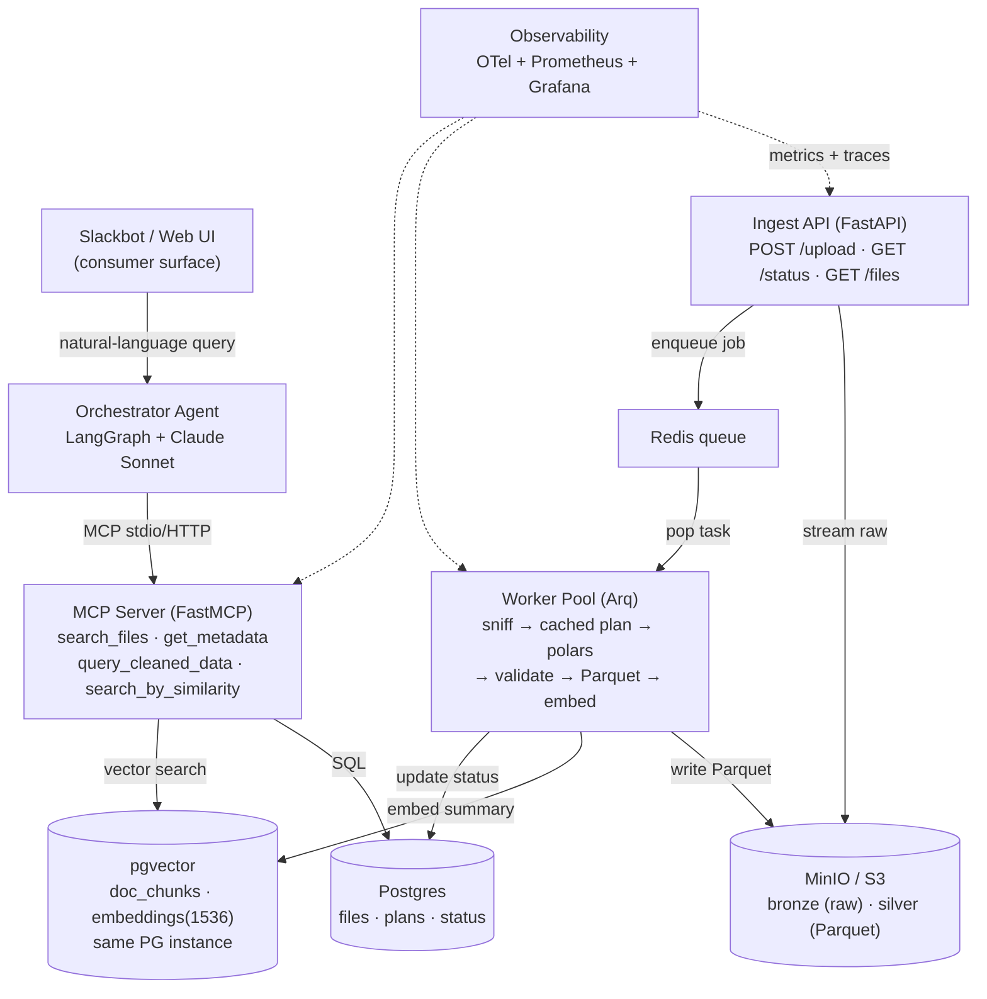

# signal-ingest

[](https://github.com/TimRoller/signal-ingest/actions/workflows/ci.yml)
[](https://www.python.org/downloads/release/python-3120/)
[](LICENSE)

> A production-shaped data ingestion + serving platform: messy CSVs in, deterministic LLM-driven cleaning, exposed via an MCP server, queryable from a Slackbot or web UI.

**Status:** Phase 0 — scaffold complete · [v0.1.0](https://github.com/TimRoller/signal-ingest/releases) · CI green

---

## Architecture



## The four-store split

The same fact lives in four physical homes, each optimized for a different question. ([ADR 0001](docs/adr/0001-four-store-architecture.md))

| Store        | Job                                               | Used for                                     |
|--------------|---------------------------------------------------|----------------------------------------------|
| **S3 raw**   | Immutable source of truth                         | Replay, audit, original artifacts            |
| **Parquet**  | Columnar analytics over millions of rows          | "Avg CPM by vertical?" via DuckDB            |
| **Postgres** | Transactional state (ACID, sub-10ms lookups)      | File status, jobs, users, plans              |
| **pgvector** | Semantic search (1536-dim embeddings)             | "Find files like…", RAG over playbooks       |

If you can write a SQL `WHERE` clause, don't embed it.

## Why these choices

Short, durable decision records — what was chosen and what we accept by choosing it:

- [ADR 0001 — Four-store data architecture](docs/adr/0001-four-store-architecture.md)
- [ADR 0002 — Real Postgres in tests via testcontainers, not mocks](docs/adr/0002-testcontainers-not-mocks.md)
- [ADR 0003 — LLM as labeler, code as worker — plan-once-per-fingerprint](docs/adr/0003-llm-as-labeler.md)
- [ADR 0004 — Observability from day one, not "later"](docs/adr/0004-observability-from-day-one.md)
- [ADR 0005 — pgvector on the same Postgres, not a separate vector DB](docs/adr/0005-pgvector-on-same-postgres.md)

## Run locally

```bash
docker compose up -d --build
curl http://localhost:8000/health   # ingest_api  → {"ok": true}
curl http://localhost:8001/health   # mcp_server  → {"ok": true}
docker compose down
```

Six services start: `postgres` (with pgvector), `redis`, `minio`, `ingest_api`, `mcp_server`, `worker`.

## Status — 8-week phased build

- [x] **Phase 0** — Repo scaffolded, docker-compose verified, CI green
- [ ] **Phase 1** — `POST /upload` → file in MinIO + row in Postgres (in progress)
- [ ] **Phase 2** — Queue + worker + deterministic cleaning end-to-end
- [ ] **Phase 3** — LLM plan generation + caching + evals
- [ ] **Phase 4** — MCP server with 4 tools
- [ ] **Phase 5** — Slackbot / web UI consumer
- [ ] **Phase 6** — Observability + Grafana dashboards + polished README

Full plan: [PLAN.md](PLAN.md). Changelog: [CHANGELOG.md](CHANGELOG.md).

## Stack

Python 3.12 · uv · FastAPI · Arq · Postgres 16 + pgvector · Redis · MinIO/S3 · polars · DuckDB · FastMCP · LangGraph · Claude Sonnet 4.6 + Haiku 4.5 · OpenTelemetry + Prometheus + Grafana · GitHub Actions · pytest + testcontainers.

## Development

```bash
uv sync
uv run ruff check .
uv run ruff format --check .
uv run mypy services shared
uv run pytest
```

## License

[MIT](LICENSE).
